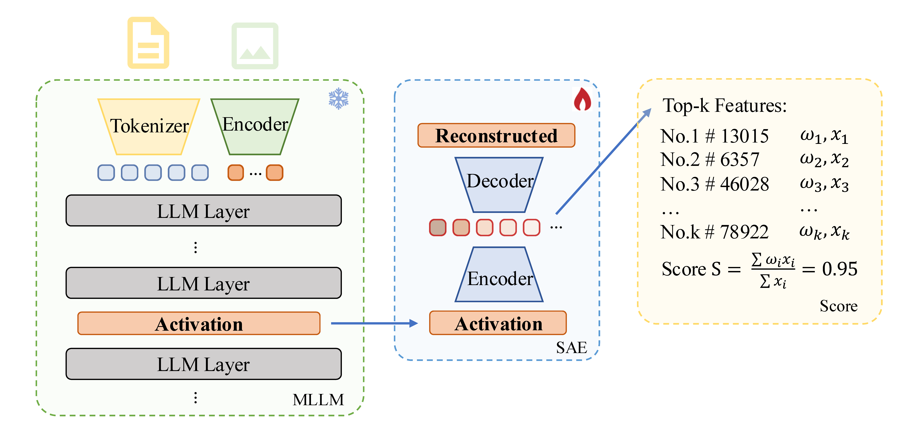
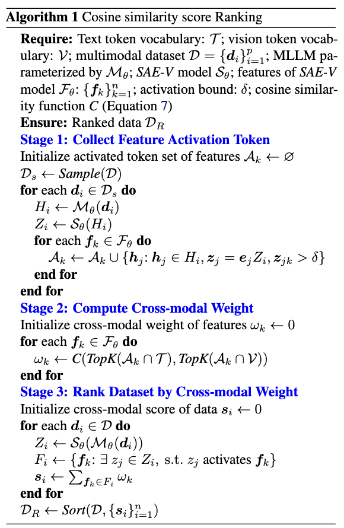

<h1 align="center">(ICML 2025 Poster) SAE-V: Interpreting Multimodal Models for Enhanced Alignment   </h1>

This repository contains the introduction and the link to the source code for our ICML 2025 paper [SAE-V: Interpreting Multimodal Models for Enhanced Alignment](https://arxiv.org/abs/2502.17514).


[Hantao Lou*](https://htlou.github.io/), [Changye Li*](https://antoinegg1.github.io/), [Jiaming Ji](https://jijiaming.com/) and [Yaodong Yang](https://www.yangyaodong.com/)

Work done by [PKU-Alignment Team](https://github.com/PKU-Alignment)

## Abstract

With the integration of image modality, the semantic space of multimodal large language models (MLLMs) is more complex than text-only models, making their interpretability more challenging and their alignment less stable, particularly susceptible to low-quality data, which can lead to inconsistencies between modalities, hallucinations, and biased outputs. As a result, developing interpretability methods for MLLMs is crucial for improving alignment quality and efficiency. In text-only LLMs, Sparse Autoencoders (SAEs) have gained attention for their ability to interpret latent representations. However, extending SAEs to multimodal settings presents new challenges due to modality fusion and the difficulty of isolating cross-modal representations. To address these challenges, we introduce *SAE-V*, a mechanistic interpretability framework that extends the SAE paradigm to MLLMs. By identifying and analyzing interpretable features along with their corresponding data, *SAE-V* enables fine-grained interpretation of both model behavior and data quality, facilitating a deeper understanding of cross-modal interactions and alignment dynamics. Moreover, by utilizing cross-modal feature weighting, *SAE-V* provides an intrinsic data filtering mechanism to enhance model alignment without requiring additional models. Specifically, when applied to the alignment process of MLLMs, *SAE-V*-based data filtering methods could achieve more than 110\% performance with less than 50\% data. Our results highlight *SAE-V*’s ability to enhance interpretability and alignment in MLLMs, providing insights into their internal mechanisms. 

## Citation

Please cite our work if you find it useful and meaningful.

```bibtex
@inproceedings{lou2025sae,
  title={SAE-V: Interpreting Multimodal Models for Enhanced Alignment},
  author={Hantao Lou and Changye Li and Jiaming Ji and Yaodong Yang},
  booktitle={The Forty-Second International Conference on Machine Learning},
  year={2025},
  url={https://openreview.net/forum?id=S4HPn5Bo6k}
}
```

### Table of Contents  <!-- omit in toc -->

- [<em>SAE-V</em>: Interpreting Multimodal Models for Enhanced Alignment](#sae-v-interpreting-multimodal-models-for-enhanced-alignment)
- [Source Code](#source-code)
- [Dataset & Models](#dataset-models)


## <em>SAE-V</em>: Interpreting Multimodal Models for Enhanced Alignment 

<div align="center">
  
</div>


SAE-V is a mechanistic interpretability framework specifically designed for multimodal large language models (MLLMs) that extends the SAE paradigm to address alignment challenges in multimodal settings. This framework not only provides fine-grained interpretation of model behavior but also significantly enhances alignment quality and efficiency through an intrinsic data filtering mechanism.

### Core Innovation and Technical Architecture

<div align="center">
  
</div>

The core innovation of SAE-V lies in extending traditional sparse autoencoders to multimodal scenarios, enabling deep understanding of both model behavior and data quality through the identification and analysis of interpretable features and their corresponding data.


### Multimodal Interpretability Analysis

SAE-V effectively captures cross-modal semantic consistency, discovering interpretable features that encompass both concrete entity concepts and abstract concepts. These features maintain consistent semantic meaning across different modalities, surpassing traditional probing methods based on raw activations.

<div align="center">
  
</div>

<div align="center">
  
</div>


The figure above demonstrates cross-modal interpretable features discovered by SAE-V, including:
- Feature #44031 (Doberman Dogs): Strongly activates for Doberman-related concepts across both text and image modalities
- Feature #11105 (Symmetry): Identifies various symmetry patterns with activation regions precisely aligned with symmetrical elements in images

### Data Filtering and Alignment Optimization

<div align="center">
  
</div>

Based on a cosine similarity score ranking algorithm, SAE-V provides an intrinsic data filtering mechanism. This method evaluates data quality by computing cross-modal feature weights, enabling the selection of high-quality multimodal data without requiring additional models.

### Experimental Validation and Performance

Experiments on multiple models including LLaVA-NeXT-7B and Chameleon-7B demonstrate that SAE-V outperforms traditional SAE methods in both reconstruction capability and interpretability. Specifically:

- **Reconstruction Performance**: SAE-V achieves 38.3% lower reconstruction loss on MLLMs and 50.6% lower on corresponding LLMs compared to SAE
- **Alignment Effectiveness**: Training with SAE-V filtered data achieves over 110% performance using only 50% of the data
- **Cross-Model Generalization**: SAE-V models exhibit excellent transferability across different architectures and model scales


## Source Code

The source code of SAE-V is available at [PKU-Alignment/SAELens-V](https://github.com/PKU-Alignment/SAELens-V) and [PKU-Alignment/TransformerLens-V](https://github.com/PKU-Alignment/TransformerLens-V). Please refer to the README files in these repositories for more details.


## Dataset & Models
- [2025/02] We have open-sourced the [SAE-V checkpoints](https://huggingface.co/PKU-Alignment/SAE-V) produced and used in our paper.


## Acknowledgements

This work is supported and funded by Peking University.

<table width="50%" cellspacing="0" cellpadding="0">
  <tr align="center" valign="middle">
    <td width="40%">
      <a href="https://www.ai.pku.edu.cn/">
        
      </a>
    </td>
  </tr>
</table>